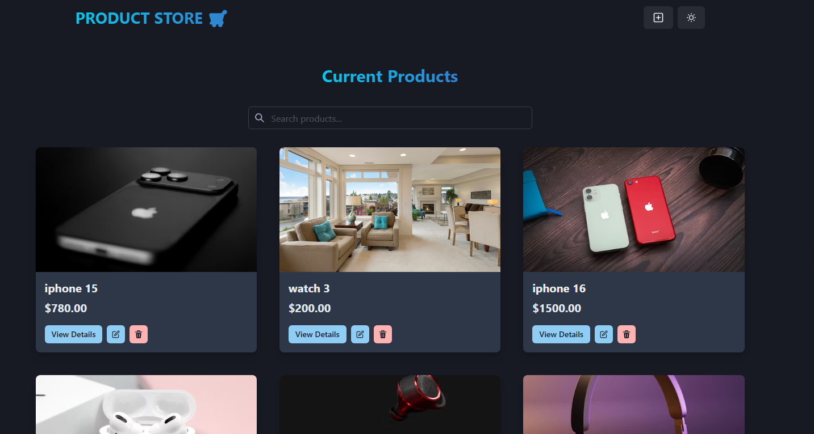
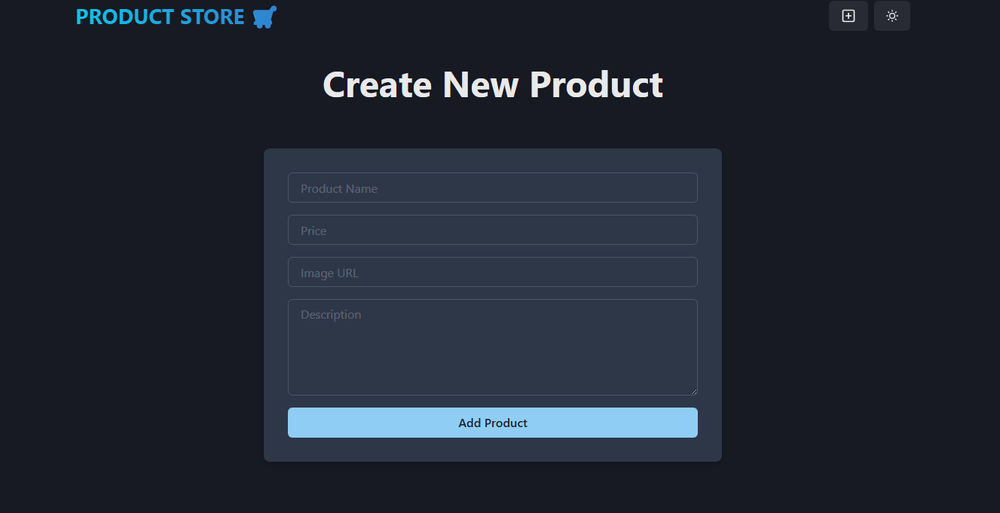
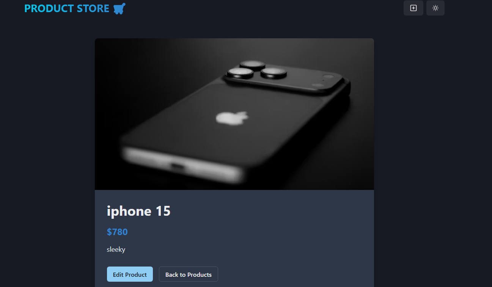

# 🛍️ Product Store

A full-stack product management application built with **React, Vite, Chakra UI, Zustand, Node.js, Express, and MongoDB**.

This application allows users to create, view, edit, and delete products through a responsive frontend connected to a RESTful backend API.

## 🚀 Live Demo

**Live Application:**
https://product-store-ln3g.onrender.com

**Backend API:**
https://product-store-api-y62u.onrender.com

**GitHub Repository:**
https://github.com/Realrichlord/Product-Store

## ✨ Features

- Create products
- View all products
- View individual product details
- Edit products
- Delete products with confirmation
- Product image previews
- Form validation
- Loading states
- Error handling
- Responsive design
- Dark mode support
- RESTful API
- MongoDB data persistence
- Production deployment

## 🧰 Tech Stack

### Frontend

- React
- Vite
- Chakra UI
- Zustand
- React Router
- JavaScript

### Backend

- Node.js
- Express.js
- MongoDB
- Mongoose
- REST API
- CORS

### Deployment & Tools

- Git
- GitHub
- Render

## 📁 Project Structure

```text
product-store/
│
├── backend/
│   ├── config/
│   │   └── db.js
│   ├── controllers/
│   ├── models/
│   ├── routes/
│   └── server.js
│
├── frontend/
│   ├── screenshots/
│   │   ├── home.png
│   │   ├── create-product.png
│   │   └── product-details.png
│   │
│   ├── src/
│   │   ├── components/
│   │   ├── pages/
│   │   ├── store/
│   │   └── App.jsx
│   │
│   └── vite.config.js
│
├── .gitignore
├── package.json
├── package-lock.json
└── README.md
```

## ⚙️ Getting Started

### 1. Clone the repository

```bash
git clone https://github.com/Realrichlord/Product-Store.git
```

### 2. Navigate into the project

```bash
cd Product-Store
```

### 3. Install backend dependencies

```bash
npm install
```

### 4. Install frontend dependencies

```bash
cd frontend
npm install
```

### 5. Environment Variables

Create a `.env` file in the project root:

```env
MONGO_URI=your_mongodb_connection_string
```

For the deployed frontend, configure:

```env
VITE_API_URL=https://your-backend-url.com
```

**Never commit your `.env` file to GitHub.**

## ▶️ Running Locally

### Start the backend

From the project root:

```bash
npm run dev
```

The backend runs on:

```text
http://localhost:5000
```

### Start the frontend

Open another terminal:

```bash
cd frontend
npm run dev
```

The frontend normally runs on:

```text
http://localhost:5173
```

## 🔌 API Endpoints

| Method | Endpoint            | Description          |
| ------ | ------------------- | -------------------- |
| GET    | `/api/products`     | Get all products     |
| GET    | `/api/products/:id` | Get a single product |
| POST   | `/api/products`     | Create a product     |
| PUT    | `/api/products/:id` | Update a product     |
| DELETE | `/api/products/:id` | Delete a product     |

## 📸 Screenshots

### Home Page



### Create Product



### Product Details



## 🧠 What I Learned

Building this project gave me practical experience with:

- Building reusable React components
- Managing application state with Zustand
- Creating RESTful APIs with Express
- Connecting Node.js applications to MongoDB
- Working with Mongoose
- Handling asynchronous API requests
- Form validation and error handling
- Connecting a frontend application to a production API
- Configuring CORS
- Managing environment variables
- Deploying a full-stack application
- Using Git and GitHub for version control

## 🔮 Future Improvements

- User authentication
- Image uploads instead of image URLs
- Product categories
- Search and filtering
- Pagination
- Product ratings and reviews
- Admin dashboard
- Automated testing
- Performance optimization
- Code splitting

## 👨‍💻 Author

**Realrichlord**

GitHub:
https://github.com/Realrichlord
